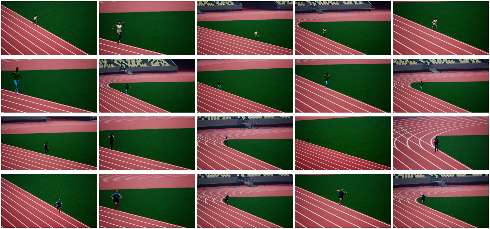

# Monocular 3D Human Pose Estimation for Sports Broadcasts using Partial Sports Field Registration

This repository contains the code, data, and tutorials for the CVSports23 paper "Monocular 3D Human Pose Estimation for Sports Broadcasts using Partial Sports Field Registration".

- **paper:** [](https://arxiv.org/abs/2304.04437)
- **data:** [sciebo, 8.3GB](https://dshs-koeln.sciebo.de/s/IIEsyX2gHRmgtZr), password: `baumgartner`
- **`.ueasset`:** [sciebo, 40MB](https://dshs-koeln.sciebo.de/s/IIEsyX2gHRmgtZr), password: `baumgartner`
- **Tutorial for generating similar data:** [UE5_tutorial.md](UE5_tutorial.md)
- **Step-by-step notebooks:** [`notebooks`](notebooks)

#### Abstract
>The filming of sporting events projects and flattens the movement of athletes in the world onto a 2D broadcast image. The pixel locations of joints in these images can be detected with high validity. Recovering the actual 3D movement of the limbs (kinematics) of the athletes requires lifting these 2D pixel locations back into a third dimension, implying a certain scene geometry. The well-known line markings of sports fields allow for the calibration of the camera and for determining the actual geometry of the scene. 
Close-up shots of athletes are required to extract detailed kinematics, which in turn obfuscates the pertinent field markers for camera calibration. We suggest *partial* sports-field registration, which determines a set of scene-consistent camera calibrations up to a single degree of freedom.
Through joint optimization of 3D pose estimation and camera calibration, we demonstrate the successful extraction of 3D running kinematics on a 400m track.
In this work, we combine advances in 2D human pose estimation and camera calibration via partial sports-field registration to demonstrate an avenue for collecting valid large-scale kinematic datasets. We generate a synthetic dataset of more than 10k images in Unreal Engine 5 with different viewpoints, running styles, and body types, to show the limitations of existing monocular 3D HPE methods. 

---
# Unreal Engine 5 simulated groundtruth data
we simulate 32 sequences with differing athlete types, running styles, camera positions, and camera trajectories:


Overall we have >10k frames with groundtruth for:
- 3D joint positions
- 2D joint positions
- intrinsic & extrinsic camera parameters

### Folder and file structure:
```
UE5sim_3DHPE/
├── ath0_fast_cam3
...
├── ath0_run                   
│   ├── ath0_run.txt              // raw output from UE5 (only for ath0_run), convert via `0_convert_from_raw.ipynb`
│   ├── ath0_run.json             // well formatted output of UE5
│   ├── groundtruth.pkl           // *see below*
│   ├── hough_results.pkl         // results for finding lines and vanishing points
│   ├── metrabs.pkl               // 3D HPE results for metrabs
│   ├── results{_gt}.pkl          // results of experiments in paper
│   ├── MovieRenders              // rendered frames
│   │   ├── ath0_run.0000.jpeg    
│   │   ├── ath0_run.0001.jpeg 
│   │   ├── ath0_run.0002.jpeg 
│   │   ├── ath0_run.0003.jpeg 
│   │   ...
...
```

**`groundtruth.pkl`**:
contains the groundtruth data extract from unreal engine for each frame of the sequence with absolute coordinates in meters.
```
In [1]: import pickle
In [2]: groundtruth = pickle.load(open('groundtruth.pkl', 'rb'))
In [3]: groundtruth[234]
Out[3]: 
{'2d': array([[ 277.64764601,  354.0611275 ],
        [ 282.66016052,  356.358349  ],
        ...]),
 '3d': array([[27.28076, -0.63193,  0.8735 ],
        [27.27585, -0.55348,  0.83458],
        ...]),
 'projection': 
    {'r': array([[-0.4856232 ,  0.86451491, -0.12955337],
                 [-0.87416824, -0.48026053,  0.07197027],
                 [ 0.        ,  0.14820188,  0.98895713]]),
     'cam_pos': array([ 79.28499, -23.70233,   9.28067]),
     'fov': 17.828249
    },
 'camrot': [-8.522737, -60.946689, 0.0],
 'campos': array([ 79.28499, -23.70233,   9.28067]),
 'fov': 17.828249}
```

the parameters in `'projection'` contain all information to project from 3D to 2D:
```
[...]
from projection_utils import project_lines
k=5
gt3d = groundtruth[k]['3d']
gt2d = groundtruth[k]['2d']
proj2d = project_lines(groundtruth[k]['projection'], gt3d)
# gt2d and proj2d are about equal.
```

### Examples for the differing sequences


# Partial Sports Field Calibration and 3D HPE
For the full computation pipeline, please check out the jupyter notebooks in the folder [`notebooks`](https://github.com/tobibaum/PartialSportsFieldReg_3DHPE/tree/main/notebooks).

# Comparison versus groundtruth and sota method
We compare our method to the fantastic work by Sarandi et al: [metrabs](https://github.com/isarandi/metrabs)

The below figure shows a comparison between groundtruth and version of metrabs with injected knowledge vs. our method with contextual knowledge (rows 2 and 4 in Tab.1)


## Citation
If you use this code, unreal blueprints, or the synthetic dataset in your research, please cite our paper:

```
@inproceedings{baumgartner2023partialreg,
title={Monocular 3D Human Pose Estimation for Sports Broadcasts using Partial Sports Field Registration},
author={Baumgartner, Tobias and Klatt, Stefanie},
booktitle={Proceedings of the IEEE/CVF Conference on Computer Vision and Pattern Recognition Workshops (CVPRw)},
year={2023}
}
```

## License

This project is licensed under the MIT License - see the [LICENSE](LICENSE) file for details.
