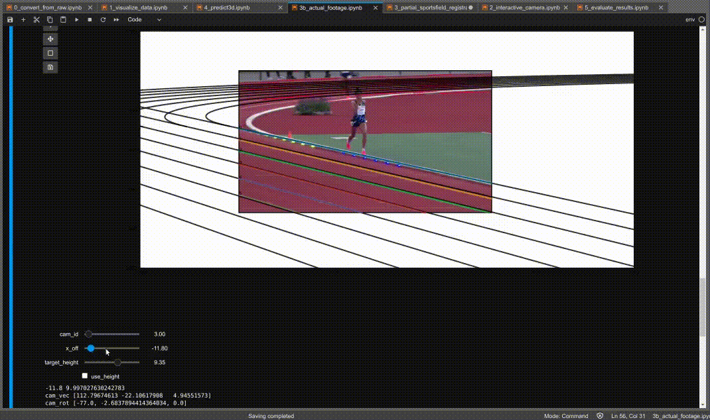
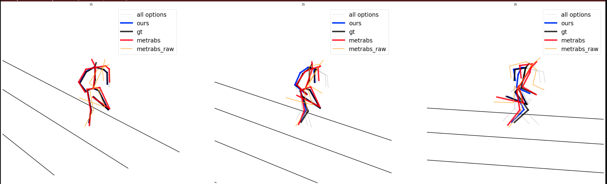
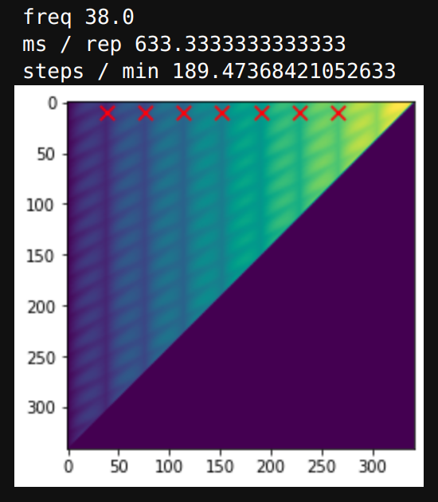
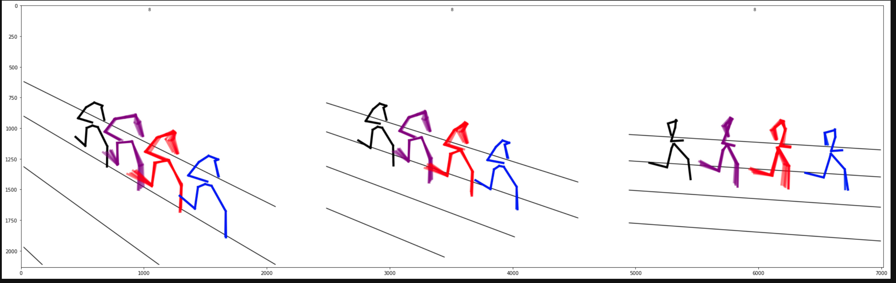

## Recipe on how to perform partial sports field registration and performing 3D HPE

### `0_convert_from_raw.ipynb`
Quick helper to transform the `.txt` output from unreal into appropriate files `groundtruth.pkl`

### `1_visualize_data.ipynb`
Exemplar code to read the synthetic dataset and functions to generate the demo video

### `2_interactive_camera.ipynb`
demonstration of our rendering pipeline and tool to explore the impact of changing each of the camera parameters on the projection.

Using `matplotlib widgets` you can change each of the camera parameters and visualize their impact on the line projections.

### `3_partial_sportsfield_registration.ipynb`
Using our novel method, we can determine all pairs of camera calibrations that are consistent with the lines in the scene. In this notebook we also compare the predicted vanishing points against the ground truth.

### `3b_actual_footage.ipynb`
Applying the same method from notebook `3_partial_sportsfield_registration.ipynb` to actual footage allows to quickly find the one camera calibration that seems most reasonable. `x_off` shifts the camera in lane track direction. `cam_id` interpolates between the determined azimuth/elevation pairs.

### `4_partial_sportsfield_registration.ipynb`
In this notebook we demonstrate how to use the calibration and 2D HPE to ray-cast predictions for the 3D pose. In the following figure, gray indicates all possible options for the segment chains. the final prediction needs to be chosen by some heuristic. in this case, we take the best possible option (closest to gt).

We then a measure of self-similarities to determine the frequency of the athletes steps ...

... and use these offsets to illustrate the error in the state-of-the-art from one repetition of the motion to the next, when the camera is moved and the athlete's locations changes.

### `5_evaluate_results.ipynb`
in this final notebook, we show how to aggregate the results (shipped with the synthetic data) and arrive at table1 in the paper.
the files `results.pkl` and `results_gt.pkl` have been generated using `13_batch_convert.py` and `16_batch_eval.py` under `src/eval`.
